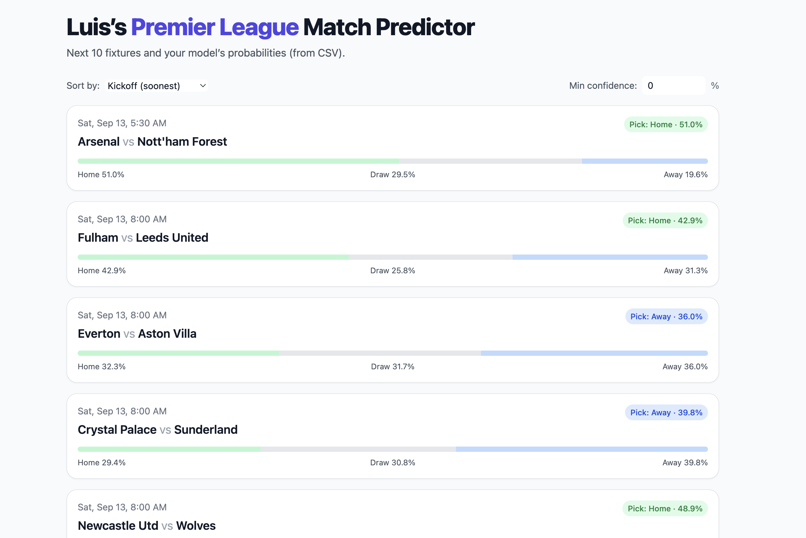

# Soccer-Stats-Predictor
Machine learning–powered app that predicts Premier League match outcomes using historical stats, odds, and rolling features.

---

---

## Features

- **Data Scraping:** Engineered a comprehensive data scraping of match statistics for 1000+ macthes using Python and pandas.
- **Data ingestion:** Combines multi-season CSVs, standardizes dates/times, and de-duplicates by `(Date, Home, Away)`.
- **Feature engineering:** Rolling 5-match stats (xG, goals, shots on target, tackles, crosses, touches, long balls) for both teams, plus timing and ID features.
- **Model:** `RandomForestClassifier` with optional per-class probability thresholds for higher macro precision.

---

