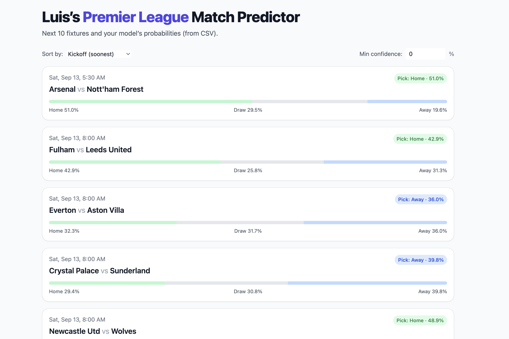
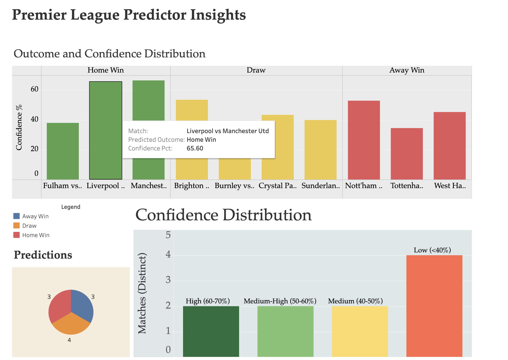

# ⚽ Soccer Stats Predictor

A production-ready machine learning system that predicts Premier League match outcomes using comprehensive web-scraped statistics, advanced feature engineering, and ensemble learning techniques.



---

## 🎯 Project Overview

This project demonstrates end-to-end machine learning engineering, from data acquisition to model deployment. It combines **web scraping**, **data engineering**, **feature engineering**, and **predictive modeling** to forecast soccer match outcomes with real-world data.

### Key Highlights
- 🔄 **Automated data pipeline** with checkpointing and resume capability
- 📊 **1,500+ historical matches** scraped from FBref across 5 Premier League seasons
- 🧠 **Random Forest classifier** with custom threshold optimization
- 🎨 **Flask web application** for interactive predictions
- ⚡ **Smart filtering** to handle newly promoted teams and incomplete data
- 📈 **Feature importance analysis** to identify key performance indicators

---

## 🛠️ Technical Stack

**Languages & Frameworks:**
- Python 3.13
- Flask + Flask-CORS (web application)
- scikit-learn (machine learning)
- pandas + numpy (data processing)
- BeautifulSoup + lxml (web scraping)

**Key Libraries:**
- `requests` with retry logic and browser-like headers
- `matplotlib` for visualization
- `PyYAML` for configuration management

---

## 🏗️ Architecture

### Data Pipeline

```
┌─────────────────┐
│  FBref.com      │  Web scraping with polite delays
│  (Data Source)  │  & anti-blocking measures
└────────┬────────┘
         │
         ▼
┌─────────────────┐
│  Raw Matches    │  Basic match data (scores, xG, etc.)
│  data/raw/      │  Per-season CSV files
└────────┬────────┘
         │
         ▼
┌─────────────────┐
│  Advanced Stats │  Possession, corners, fouls, etc.
│  Scraper        │  Checkpoint-based for resilience
└────────┬────────┘
         │
         ▼
┌─────────────────┐
│  Processed Data │  Merged stats + metadata
│  data/processed/│  Ready for ML pipeline
└────────┬────────┘
         │
         ▼
┌─────────────────┐
│  Feature Engine │  Rolling windows, venue-specific
│                 │  form, derived metrics
└────────┬────────┘
         │
         ▼
┌─────────────────┐
│  ML Model       │  Random Forest with threshold
│  (600 trees)    │  optimization for precision
└────────┬────────┘
         │
         ▼
┌─────────────────┐
│  Predictions    │  Upcoming fixtures with
│  & Web App      │  confidence scores
└─────────────────┘
```

### Web Scraping Features

**Resilient Scraping with `matches_adv.py`:**
- ✅ **Automatic checkpointing** every N matches to prevent data loss
- ✅ **Resume capability** - skips already-scraped matches on restart
- ✅ **Smart filtering** - only processes completed matches (ignores future fixtures)
- ✅ **Retry logic** with exponential backoff for failed requests
- ✅ **Browser-like headers** to avoid being blocked
- ✅ **Polite delays** (3-8 seconds) to respect server resources

**HTML Parsing:**
- Handles both DOM and HTML comment-wrapped tables
- Extracts stats from `div#team_stats` (possession, passing accuracy, shots)
- Parses `div#team_stats_extra` grids (corners, fouls, crosses, interceptions)

---

## 🎓 Machine Learning Features

### Feature Engineering

**Venue-Specific Form (Last 3 Games):**
- Home team performance at home (goals, xG, shots, tackles, crosses, etc.)
- Away team performance away (same metrics)

**Overall Recent Form (Last 5 Games):**
- Both teams' performance regardless of venue
- Includes offensive metrics (goals, xG, shots) and defensive (goals conceded, saves)

**Additional Features:**
- Match timing (hour, day of week, minutes since midnight)
- Team encoding (opponent, home team, venue)
- Advanced stats (possession, passing accuracy, tackles, interceptions, long balls)

### Model Architecture

**Random Forest Classifier:**
- 600 decision trees for robust predictions
- `balanced_subsample` class weighting to handle imbalanced data
- Custom probability thresholds for precision optimization
- Configurable via YAML for easy experimentation

**Training Strategy:**
- Train on 3-4 historical seasons (~1,140 matches)
- Validate on most recent completed season (~380 matches)
- Progressive retraining: incorporates completed test season matches
- Handles newly promoted teams via NaN imputation

---

## 📊 Model Performance

**Validation Metrics (2024-2025 Season):**
- Accuracy: ~52%
- Macro Precision: ~50% (with threshold optimization)

**Prediction Classes:**
- 0 = Away Win
- 1 = Draw
- 2 = Home Win

---

## 🚀 Quick Start

### Installation

```bash
# Clone repository
git clone https://github.com/luismjr/Soccer-Stats-Predictor.git
cd Soccer-Stats-Predictor

# Create virtual environment
python3 -m venv venv
source venv/bin/activate

# Install dependencies
pip install -r requirements.txt
```

### Running the Pipeline

**1. Scrape Basic Match Data:**
```bash
python src/scraping/matches.py
```
Fetches schedules, scores, and match report URLs for the last 5 seasons.

**2. Scrape Advanced Statistics:**
```bash
python src/scraping/matches_adv.py --season 2025-2026 --checkpoint-every 10 --delay-min 4 --delay-max 8
```
Extracts detailed match stats (possession, corners, fouls, etc.) with automatic checkpointing.

**3. Train Model & Generate Predictions:**
```bash
python src/models/match_predictor.py --config configs/predict_config.yaml
```
Trains on historical data and outputs predictions for next 10 upcoming fixtures.

**4. Generate Tableau Exports (Optional):**
```bash
python src/tableau/export_tableau.py
```
Creates comprehensive CSV files for Tableau dashboards with advanced analytics.

**5. Launch Web App:**
```bash
python app.py
```
Opens interactive web interface at `http://localhost:5000`

---

## 📊 Interactive Visualizations

**Tableau Dashboards:** Explore live interactive dashboards at [My Tableau Profile](https://public.tableau.com/app/profile/luis.martinez5851/vizzes)



---

## 📁 Project Structure

```
Soccer-Stats-Predictor/
├── src/                          # Source code modules
│   ├── scraping/                 # Web scraping utilities
│   │   ├── matches.py           # Basic match data scraper
│   │   ├── matches_adv.py       # Advanced stats scraper (checkpointing)
│   │   ├── get_season.py        # Season-level stats scraper
│   │   ├── clean_season.py      # Squad data processor
│   │   └── README.md            # Scraping module documentation
│   ├── models/                   # Machine learning pipeline
│   │   ├── match_predictor.py   # ML pipeline & feature engineering
│   │   └── README.md            # Models module documentation
│   ├── tableau/                  # Tableau export utilities
│   │   ├── export_tableau.py    # Advanced Tableau data export
│   │   └── README.md            # Tableau module documentation
│   └── README.md                # Source code overview
├── configs/                      # Configuration files
│   ├── train_config.yaml        # Training/validation configuration
│   ├── predict_config.yaml      # Production prediction configuration
│   └── README.md                # Configuration documentation
├── data/                         # Data storage
│   ├── raw/                     # Scraped raw data
│   │   ├── match/              # Raw match data by season
│   │   ├── season/             # Raw season statistics
│   │   └── README.md           # Raw data documentation
│   ├── processed/               # Cleaned and processed data
│   │   ├── match/              # Processed match statistics
│   │   ├── season/             # Processed season statistics
│   │   └── README.md           # Processed data documentation
│   ├── prediction/              # Model predictions and features
│   │   ├── prediction_data.csv # Main prediction results
│   │   ├── prediction_features.csv # Feature data for predictions
│   │   └── README.md           # Prediction data documentation
│   ├── tableau/                 # Tableau-ready exports
│   │   ├── main_predictions.csv # Main dashboard dataset
│   │   ├── team_analysis.csv    # Team-focused analysis
│   │   ├── feature_analysis.csv # Feature importance analysis
│   │   └── summary_stats.csv   # High-level statistics
│   ├── tmp/                     # Temporary and checkpoint files
│   │   └── README.md           # Temporary data documentation
│   └── README.md               # Data overview documentation
├── docs/                        # Documentation and visualizations
│   ├── general/                 # General documentation assets
│   │   ├── preview.png         # Web application screenshot
│   │   ├── feature_importances.png # Top 5 model features
│   │   ├── tableau_ss.png      # Tableau dashboard screenshot
│   │   └── README.md           # Visual assets documentation
│   └── README.md               # Documentation overview
├── templates/                   # Web application templates
│   └── index.html              # Main web app frontend
├── venv/                       # Python virtual environment
├── app.py                      # Flask web application entry point
├── requirements.txt            # Python dependencies
└── README.md                   # This file - project overview
```

---

## 🧪 Configuration Options

The project uses YAML configuration files for easy experimentation:

**Training Configuration (`configs/train_config.yaml`):**
- Data sources (glob patterns or explicit file lists)
- Season splits (train/validation/test)
- Model hyperparameters (n_estimators, min_samples_split, etc.)
- Threshold optimization settings
- Output paths

**Production Configuration (`configs/predict_config.yaml`):**
- Uses all available historical data (4 seasons)
- Disables thresholds for balanced predictions
- Optimized for real-world forecasting

---

## 🔬 Technical Innovations

### 1. Checkpoint-Based Web Scraping
Implements atomic CSV writes and checkpoint files to ensure data integrity even if scraping is interrupted. Resumes automatically from last checkpoint.

### 2. Venue-Specific Form Features
Separates home/away performance to capture venue effects, a critical factor in soccer predictions.

### 3. Smart Data Handling
- Automatic filtering of incomplete matches (future fixtures)
- URL pattern detection to distinguish match reports from history pages
- NaN imputation for newly promoted teams without historical data

### 4. Threshold Optimization
Custom probability threshold learning to maximize macro precision on validation set, addressing class imbalance.

### 5. Production-Ready Pipeline
Clean separation of training, validation, and prediction modes via configuration files. No code changes needed for different use cases.

---

## 📈 Future Enhancements

- [ ] Add squad-level features (injuries, transfers, player form)
- [ ] Incorporate betting odds as features
- [ ] Implement XGBoost/LightGBM for comparison
- [ ] Add confidence intervals for predictions
- [ ] Real-time API for live match updates
- [ ] Deployment to cloud (AWS/GCP)

---

## 🤝 Skills Demonstrated

**Data Engineering:**
- Web scraping with resilience (retries, checkpointing, error handling)
- ETL pipeline design (extract, transform, load)
- Data cleaning and normalization
- Multi-source data integration

**Machine Learning:**
- Feature engineering (rolling windows, derived metrics, encoding)
- Ensemble methods (Random Forest)
- Hyperparameter tuning
- Model evaluation and validation
- Threshold optimization for precision

**Data Visualization & Business Intelligence:**
- Advanced Tableau dashboard development and deployment
- Interactive data visualization design
- Translation of technical features to actionable insights
- Data storytelling through comprehensive visual analytics
- Public dashboard publishing and user experience optimization

**Software Engineering:**
- Modular code architecture
- Configuration-driven design
- Error handling and logging
- Version control (Git)
- Documentation

**Tools & Technologies:**
- Python ecosystem (pandas, scikit-learn, Flask)
- Tableau Desktop/Public for advanced data visualization
- RESTful web scraping
- YAML configuration
- Virtual environments
- Command-line interfaces

---

## 📝 License

This project is for educational and portfolio purposes.

---

## 👨‍💻 Author

**Luis Martinez**

*Demonstrating proficiency in data science, machine learning engineering, and full-stack development.*

---

## 🙏 Acknowledgments

- Data source: [FBref](https://fbref.com/) (Sports Reference LLC)
- Inspired by the analytics revolution in modern soccer
