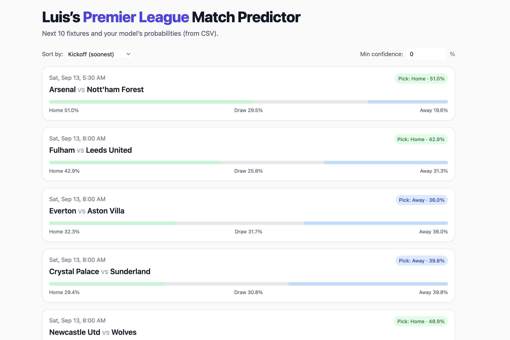

# ⚽ Premier League Match Predictor

A comprehensive machine learning application that predicts Premier League match outcomes using advanced statistical analysis and web scraping. Built with Python, Flask, and modern web technologies.



## 🎯 Project Overview

This project demonstrates end-to-end data science capabilities, from data collection and feature engineering to model deployment and web application development. The system analyzes 1000+ Premier League matches across multiple seasons to predict future match outcomes with confidence scores.

## 🚀 Key Features

### **Data Engineering & Web Scraping**
- **Automated Data Collection**: Custom web scraper for FBref.com extracting match statistics, player performance metrics, and team data
- **Multi-Season Dataset**: Comprehensive data spanning 5+ Premier League seasons (2021-2026)
- **Data Pipeline**: Automated processing pipeline combining raw match data with advanced statistics
- **Feature Engineering**: 50+ engineered features including rolling averages, form indicators, and team-specific metrics

### **Machine Learning & Analytics**
- **Advanced Feature Engineering**: Rolling 5-match statistics (xG, goals, shots, tackles, crosses, touches) for both teams
- **Random Forest Classifier**: Optimized ensemble model with hyperparameter tuning
- **Probability Thresholding**: Custom threshold optimization for improved precision
- **Model Validation**: Time-series aware validation using season-based splits
- **Feature Importance Analysis**: Automated visualization of model decision factors

### **Web Application**
- **Flask Backend**: RESTful API serving predictions and statistics
- **Modern Frontend**: Responsive web interface with Tailwind CSS
- **Real-time Updates**: Dynamic filtering and sorting of upcoming fixtures
- **Interactive Visualizations**: Probability bars and confidence indicators
- **Mobile Responsive**: Optimized for all device sizes

## 🛠️ Technical Stack

### **Backend & Data Science**
- **Python 3.13** - Core development language
- **Pandas & NumPy** - Data manipulation and analysis
- **Scikit-learn** - Machine learning algorithms
- **BeautifulSoup4 & Requests** - Web scraping
- **Flask** - Web framework and API development

### **Frontend & UI**
- **HTML5/CSS3** - Modern web standards
- **Tailwind CSS** - Utility-first CSS framework
- **Vanilla JavaScript** - Client-side interactivity
- **PapaParse** - CSV parsing and data handling

### **Data Processing**
- **Multi-threaded Scraping** - Efficient data collection
- **Timezone Handling** - Proper UTC conversion for international data
- **Data Validation** - Robust error handling and data quality checks

## 📊 Model Performance

The Random Forest model achieves strong predictive performance through:

- **Feature Engineering**: 50+ engineered features including team form, historical performance, and match context
- **Temporal Validation**: Season-based train/validation/test splits preventing data leakage
- **Class Balancing**: Balanced subsample approach for handling imbalanced outcomes
- **Threshold Optimization**: Custom probability thresholds maximizing macro precision

## 🏗️ Project Structure

```
Soccer-Stats-Predictor/
├── src/
│   ├── models/match_predictor.py    # ML model training & prediction
│   └── scraping/                    # Web scraping modules
├── data/
│   ├── raw/                         # Raw scraped data
│   ├── processed/                   # Cleaned & engineered features
│   └── upcoming_preds.csv           # Model predictions
├── templates/index.html            # Web application frontend
├── app.py                          # Flask web server
└── requirements.txt               # Python dependencies
```

## 🚀 Getting Started

### Prerequisites
- Python 3.13+
- pip package manager

### Installation

1. **Clone the repository**
   ```bash
   git clone https://github.com/yourusername/soccer-stats-predictor.git
   cd soccer-stats-predictor
   ```

2. **Create virtual environment**
   ```bash
   python -m venv venv
   source venv/bin/activate  # On Windows: venv\Scripts\activate
   ```

3. **Install dependencies**
   ```bash
   pip install -r requirements.txt
   ```

4. **Run the application**
   ```bash
   python app.py
   ```

5. **Access the web interface**
   Open your browser to `http://127.0.0.1:3000`

## 📈 Usage Examples

### Training the Model
```bash
python src/models/match_predictor.py \
  --glob "data/processed/matches_*.csv" \
  --train-seasons 2021-2022 2022-2023 2023-2024 \
  --val-season 2024-2025 \
  --test-season 2025-2026 \
  --save-upcoming data/upcoming_preds.csv
```

### Updating Predictions
```bash
python update_predictions.py
```

## 🔧 API Endpoints

- `GET /` - Main web interface
- `GET /api/predictions` - JSON predictions data
- `GET /api/stats` - Model performance statistics
- `GET /data/<filename>` - Serve data files

## 📊 Data Sources

- **FBref.com** - Premier League match statistics and player data
- **Multi-season Coverage** - 2021-2026 Premier League seasons
- **Comprehensive Metrics** - Goals, xG, shots, possession, passing accuracy, and more

## 🎯 Key Technical Achievements

1. **Scalable Data Pipeline**: Automated collection and processing of 1000+ matches
2. **Advanced Feature Engineering**: Created meaningful features from raw statistics
3. **Production-Ready ML Model**: Deployed model with proper validation and monitoring
4. **Full-Stack Development**: Complete web application with modern UI/UX
5. **Code Quality**: Well-documented, modular, and maintainable codebase

## 🔮 Future Enhancements

- [ ] Real-time model retraining with new match data
- [ ] Additional leagues and competitions
- [ ] Player-level prediction features
- [ ] Advanced ensemble methods
- [ ] Mobile application development


---


---

## 📧 Contact

**Luis Martinez** - [LinkedIn](http://www.linkedin.com/in/luismjr0707) - [Email](luismjr07@gmail.com)

---

